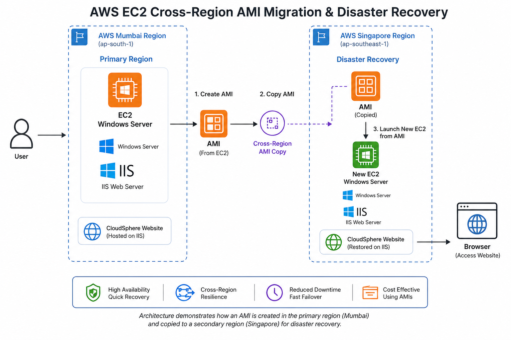

# 🌍 AWS EC2 Cross-Region AMI Migration & Disaster Recovery (Windows Server IIS)

<p align="center">


</p>

<p align="center">

A real-world AWS Cloud project demonstrating <b>Cross-Region AMI Migration</b>, <b>Disaster Recovery</b>, and <b>Windows Server IIS Website Hosting</b> using Amazon EC2.

</p>

---

# 📑 Table of Contents

- 📌 Project Overview
- 🎯 Project Objectives
- 🏗 Solution Architecture
- ☁ AWS Services Used
- 💻 Technologies Used
- 🚀 Project Implementation
- 📸 Project Screenshots
- ✨ Key Features
- 📚 Learning Outcomes
- 🚀 Future Enhancements
- 👩‍💻 Author
- 📄 License

---

# 📌 Project Overview

This project demonstrates a practical implementation of **AWS Disaster Recovery (DR)** using **Amazon EC2**, **Amazon Machine Images (AMI)**, and **Microsoft Internet Information Services (IIS)**.

A Windows Server EC2 instance hosting a business website was deployed in the **Mumbai Region (ap-south-1)**. After successfully configuring IIS and hosting the website, a custom **Amazon Machine Image (AMI)** was created.

The AMI was copied to the **Singapore Region (ap-southeast-1)** and used to launch a brand-new Windows Server EC2 instance.

Finally, the migrated server was verified by connecting through **Remote Desktop Protocol (RDP)** and confirming that the hosted website was fully operational.

This project demonstrates how organizations can use AWS to create reliable backups and rapidly recover workloads in another AWS Region during infrastructure failures or disaster scenarios.

---

# 🎯 Project Objectives

- Deploy a Windows Server EC2 instance.
- Configure Microsoft IIS Web Server.
- Host a business website on AWS.
- Create a custom Amazon Machine Image (AMI).
- Copy the AMI to another AWS Region.
- Launch a new EC2 instance from the copied AMI.
- Verify successful website restoration.
- Demonstrate Cross-Region Disaster Recovery.

---

# 🏗 Solution Architecture

<p align="center">



</p>

---

# ☁ AWS Services Used

| AWS Service | Description |
|-------------|-------------|
| Amazon EC2 | Virtual Windows Server |
| Amazon Machine Image (AMI) | Backup of the EC2 Instance |
| Amazon EBS | Persistent Storage |
| Security Groups | Firewall Configuration |
| Microsoft IIS | Website Hosting |
| Remote Desktop Protocol (RDP) | Remote Administration |

---

# 💻 Technologies Used

- Amazon Web Services (AWS)
- Windows Server 2022
- Microsoft IIS
- Amazon EC2
- Amazon Machine Images (AMI)
- Remote Desktop (RDP)
- HTML5
- CSS3
- JavaScript
- Git
- GitHub

---# 🚀 Project Implementation

This project was completed using the following implementation process:

### Phase 1 – Deploy Windows Server

- Launched a Windows Server EC2 instance in the **Mumbai Region (ap-south-1)**.
- Configured inbound Security Group rules for:
  - HTTP (80)
  - HTTPS (443)
  - RDP (3389)
- Connected to the instance using **Remote Desktop Protocol (RDP)**.

---

### Phase 2 – Configure IIS

- Installed **Microsoft Internet Information Services (IIS)**.
- Copied the CloudSphere Solutions website files into:

```text
C:\inetpub\wwwroot
```

- Started the Default Website from IIS Manager.
- Verified successful hosting using the EC2 Public IP.

---

### Phase 3 – Create Custom AMI

- Created a custom **Amazon Machine Image (AMI)** from the running Windows Server.
- Waited until the AMI status changed from **Pending** to **Available**.

---

### Phase 4 – Cross-Region Migration

- Copied the AMI from:

```text
Mumbai (ap-south-1)
        │
        ▼
Singapore (ap-southeast-1)
```

- Waited until the copied AMI became **Available** in the destination region.

---

### Phase 5 – Launch Disaster Recovery Server

- Launched a new Windows Server EC2 instance using the copied AMI.
- Used the existing Key Pair.
- Configured Security Groups.
- Retrieved the Windows Administrator Password.
- Connected through Remote Desktop.

---

### Phase 6 – Website Verification

- Verified IIS was running correctly.
- Opened:

```text
http://localhost
```

- Verified website accessibility using the new EC2 Public IP.
- Confirmed successful Disaster Recovery deployment.

---

# 🔄 Disaster Recovery Workflow

<p align="center">


</p>

---

# 📸 Project Screenshots

## 🖥 Original Windows Server EC2

<p align="center">

</p>

---

## 💾 Custom AMI Created Successfully

<p align="center">

</p>

---

## 🌏 Copied AMI in Singapore Region

<p align="center">

</p>

---

## 🚀 Launch New EC2 Instance

<p align="center">

</p>

---

## ⚙ Configure New EC2 Instance

<p align="center">

</p>

---
## 🔑 Retrieve Windows Administrator Password

<p align="center">

</p>

The Administrator password was decrypted using the EC2 key pair and used to establish a secure Remote Desktop connection to the new Windows Server instance.

---

## 🖥 Remote Desktop Connection (RDP)

<p align="center">

</p>

Successfully connected to the migrated EC2 instance using **Remote Desktop Protocol (RDP)** and verified the Windows Server environment.

---

## 🌐 Verify Website on Localhost

<p align="center">

</p>

After connecting through RDP, the hosted website was verified locally using:

```text
http://localhost
```

This confirmed that Microsoft IIS was serving the application correctly.

---

## ✅ Successful Deployment

<p align="center">

</p>

The migration process completed successfully without requiring manual website reconfiguration.

---

## 🎉 Website Running on Disaster Recovery Server

<p align="center">

</p>

The website was successfully restored on the new Windows Server EC2 instance created from the copied AMI in the **Singapore Region**, confirming a successful Cross-Region Disaster Recovery implementation.

---

# ✨ Key Features

- ✅ Windows Server EC2 Deployment
- ✅ Microsoft IIS Website Hosting
- ✅ Custom Amazon Machine Image (AMI)
- ✅ Cross-Region AMI Migration
- ✅ Disaster Recovery Implementation
- ✅ Windows Remote Desktop (RDP)
- ✅ Website Restoration
- ✅ Cloud Backup Strategy
- ✅ High Availability Concept
- ✅ AWS Best Practices

---

# 🎯 Skills Demonstrated

- Amazon EC2
- Windows Server Administration
- Microsoft IIS Configuration
- Amazon Machine Images (AMI)
- Cross-Region Migration
- Disaster Recovery Planning
- AWS Networking
- Security Groups
- Remote Desktop Management
- Git & GitHub Documentation

---

# 📚 Learning Outcomes

Through this project, I gained practical experience in:

- Deploying Windows Server instances on AWS
- Configuring Microsoft IIS for web hosting
- Creating and managing custom AMIs
- Performing Cross-Region AMI migration
- Launching EC2 instances from copied AMIs
- Implementing Disaster Recovery strategies
- Verifying application availability after migration
- Managing cloud infrastructure using AWS best practices

---
# 🚀 Future Enhancements

This project can be further enhanced by implementing:

- 🌐 Route 53 DNS Failover
- ⚖️ Elastic Load Balancer (ELB)
- 📈 Auto Scaling Group (ASG)
- 💾 AWS Backup Service
- 📊 Amazon CloudWatch Monitoring
- 🔒 SSL Certificate (HTTPS)
- 🌍 Custom Domain Name
- ⚙️ Infrastructure as Code (Terraform)
- 🚀 CI/CD Pipeline using GitHub Actions
- ☁️ Multi-Region High Availability Architecture

---

# 💡 Best Practices Followed

- Used a custom Amazon Machine Image (AMI) for backup and recovery.
- Performed Cross-Region AMI migration for disaster recovery.
- Secured remote access using Remote Desktop Protocol (RDP).
- Configured Security Groups to allow only required inbound traffic.
- Verified website availability after migration.
- Followed AWS best practices for EC2 deployment and backup.

---

# 📈 Project Highlights

| Feature | Status |
|---------|:------:|
| Windows Server Deployment | ✅ |
| IIS Website Hosting | ✅ |
| Custom AMI Creation | ✅ |
| Cross-Region AMI Copy | ✅ |
| Disaster Recovery | ✅ |
| EC2 Restoration | ✅ |
| Website Verification | ✅ |
| GitHub Documentation | ✅ |

---

# 🏆 Project Outcome

Successfully demonstrated a complete **AWS Cross-Region Disaster Recovery** workflow by:

- Deploying a Windows Server EC2 instance.
- Hosting a website using Microsoft IIS.
- Creating a custom Amazon Machine Image (AMI).
- Copying the AMI to another AWS Region.
- Launching a new EC2 instance from the copied AMI.
- Restoring and verifying the hosted website.
- Validating a real-world Disaster Recovery scenario.

This project showcases practical experience with **AWS Infrastructure, Windows Server Administration, IIS Web Hosting, and Disaster Recovery**, making it suitable for a Cloud Computing or DevOps portfolio.

---

# 👩‍💻 Author

## **Ajwa Farooq**

**BS Software Engineering Student**

**National Textile University, Pakistan**

### 🌐 GitHub

https://github.com/Ajwafarooq

---

# 🤝 Connect

If you found this project helpful, feel free to:

- ⭐ Star this repository
- 🍴 Fork this repository
- 📢 Share your feedback

---

# 📄 License

This project is licensed under the **MIT License**.

You are welcome to use this project for learning, educational purposes, and personal portfolio development.

---

<p align="center">

### ⭐ Thank You for Visiting This Repository ⭐

**AWS EC2 Cross-Region AMI Migration & Disaster Recovery**

*Built with AWS • Windows Server • Microsoft IIS • GitHub*

</p>