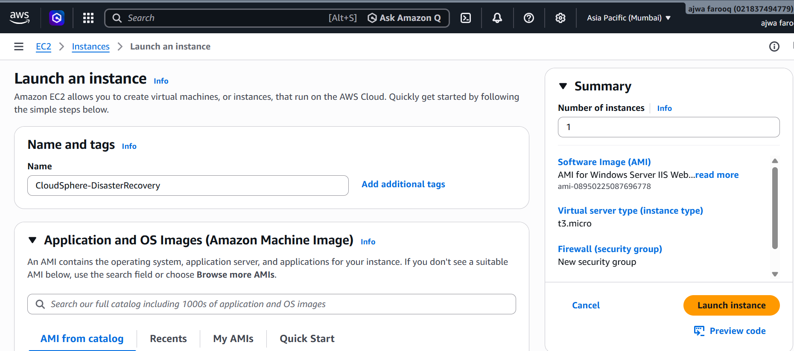
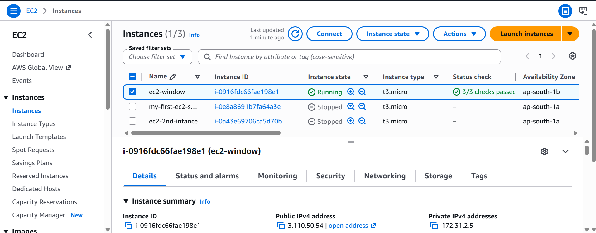
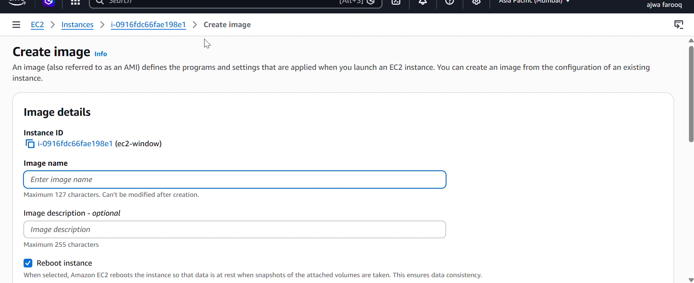
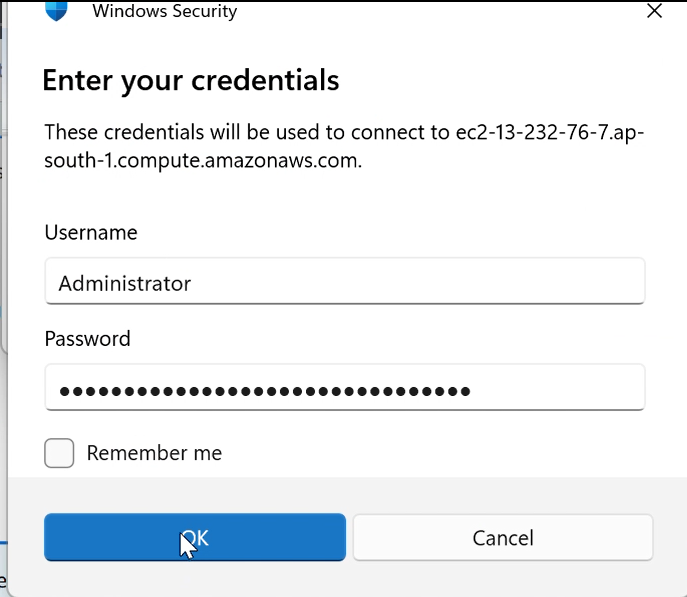
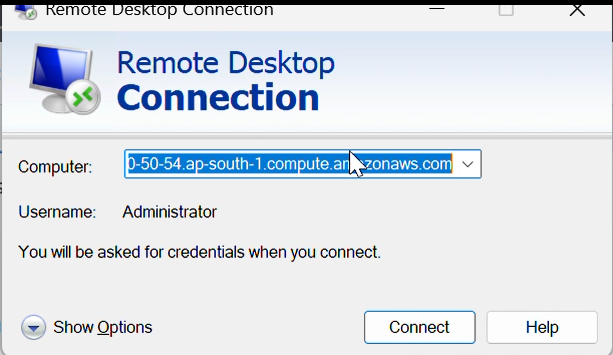
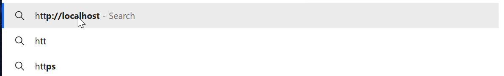
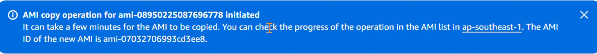
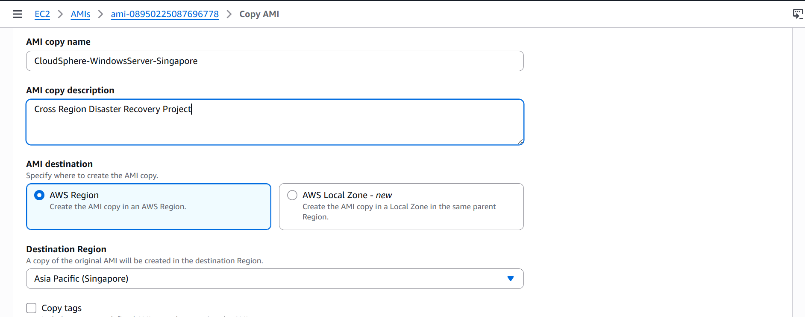
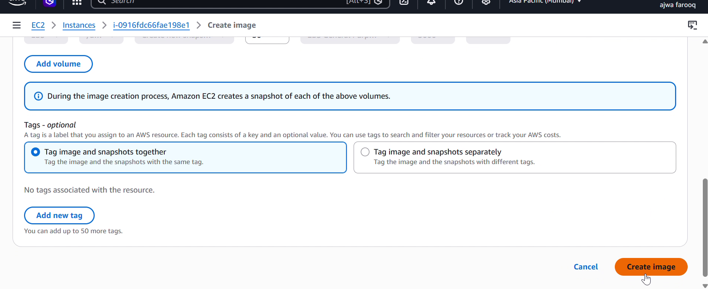

# 🌍 AWS EC2 Cross-Region AMI Migration & Disaster Recovery

<p align="center">


</p>

## 📌 Project Overview

This project demonstrates a real-world **AWS Disaster Recovery** solution using **Amazon EC2**, **Amazon Machine Images (AMI)**, and **Microsoft IIS**.

A Windows Server EC2 instance hosting an IIS website was deployed in the **Mumbai Region**, converted into a custom AMI, copied to the **Singapore Region**, and launched as a new EC2 instance — successfully restoring the website in a completely different region with zero data loss.

### 📑 Table of Contents
- [Architecture Diagram](#-architecture-diagram)
- [AWS Services Used](#-aws-services-used)
- [Project Workflow](#-project-workflow)
- [Implementation & Screenshots](#-implementation--screenshots)
- [Key Features](#-key-features)
- [Skills Demonstrated](#-skills-demonstrated)

---

## 🏗 Architecture Diagram

<p align="center">

</p>

---

## ☁ AWS Services Used

- Amazon EC2
- Amazon Machine Image (AMI)
- Amazon EBS
- Microsoft IIS
- Security Groups
- Remote Desktop Protocol (RDP)

---

## 🚀 Project Workflow

```text
Windows Server EC2 (Mumbai Region)
        │
        ▼
Host Website using IIS
        │
        ▼
Create Custom AMI
        │
        ▼
Copy AMI to Singapore Region
        │
        ▼
Launch New EC2 Instance (Singapore)
        │
        ▼
Connect using RDP
        │
        ▼
Verify Website
        │
        ▼
✅ Disaster Recovery Completed
```

---

## 📸 Implementation & Screenshots

### 1️⃣ Launch the Original Windows Server (Mumbai)

<p align="center">

</p>
<p align="center">

</p>

### 2️⃣ Original Instance Running

<p align="center">

</p>

### 3️⃣ Retrieve Windows Password

<p align="center">

</p>

### 4️⃣ Connect via Remote Desktop (RDP)

<p align="center">

</p>

### 5️⃣ Host & Verify Website on IIS (Localhost)

<p align="center">

</p>
<p align="center">

</p>

### 6️⃣ Create Custom AMI & Copy to Singapore Region

<p align="center">

</p>
<p align="center">

</p>

### 7️⃣ Launch New EC2 Instance from AMI (Singapore)

<p align="center">

</p>

### 8️⃣ Website Restored & Running in New Region 🎉

<p align="center">

</p>

> ✅ This confirms successful **cross-region disaster recovery** — the website was fully restored in Singapore from a Mumbai-based AMI, with no data loss.

---

## ✨ Key Features

- Windows Server EC2 deployment
- IIS website hosting
- Custom AMI creation
- Cross-region AMI migration (Mumbai → Singapore)
- Disaster recovery implementation
- Website restoration & verification
- Secure RDP access

---

## 📚 Skills Demonstrated

- AWS EC2
- Windows Server
- Microsoft IIS
- Amazon Machine Images (AMI)
- Disaster Recovery
- Cross-Region Migration
- AWS Security Groups
- Git & GitHub

---

## 👨‍💻 Author

**Ajwa Farooq**
BS Software Engineering Student

🌐 **GitHub:** [github.com/Ajwafarooq](https://github.com/Ajwafarooq)

---

## ⭐ Support

If you found this project useful, please consider giving this repository a **Star ⭐**.
